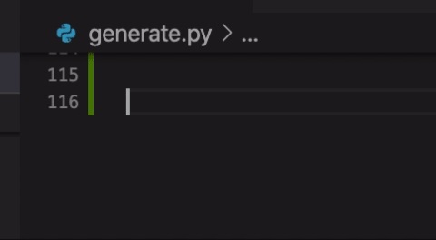

## Instructions
1. Install the extension
2. Type '\alpha'
3. Hit tab.

## Credit
[Viktor Qvarfordt](https://github.com/ViktorQvarfordt/unicode-latex)'s repo is the source of the latex -> unicode mappings, and saved me some excruciating work.
